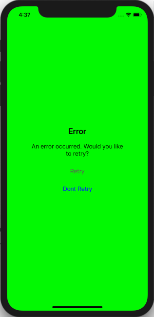

[](https://travis-ci.com/levibostian/Empty-iOS)
[](https://cocoapods.org/pods/Empty)
[](https://cocoapods.org/pods/Empty)
[](https://cocoapods.org/pods/Empty)


# Empty

Quick and easy UIView to use when you have no data to show. Also great for displaying errors!

*Android developer? Check out the [Android version of Empty](https://github.com/levibostian/empty-android)*

## What is Empty?

During those times where there is no data to show to your user, Empty to the rescue! Empty is a quick and easy way to display a message to your user and help with the next step by adding a button with 1 line of code.

Configured with default settings that will work for most use cases, but customizable enough to cover more.



## Why use Empty?

* Swift API
* Lightweight. Zero dependencies. 
* UI testing friendly. 
* Setup with default values that should work for 95% of your use cases. Customizable for those other cases. 
* Full test suite. [](https://travis-ci.com/levibostian/Empty-iOS)
* [Full documentation](https://levibostian.github.io/Empty-iOS/). 

I recommend you check out 2 other libraries that work nicely with Empty: [PleaseHold](https://github.com/levibostian/PleaseHold-iOS) and [Swapper](https://github.com/levibostian/Swapper-iOS).

## Installation

Empty is available through [CocoaPods](https://cocoapods.org/pods/Empty). To install it, simply add the following line to your Podfile:

```ruby
pod 'Empty', '~> version-here'
```

Replace `version-here` with: [](https://cocoapods.org/pods/Empty) as this is the latest version at this time. 

# Getting started

* Create an instance of `EmptyView` in your `UIViewController`. You can do this with Storyboard by adding a `UIView` to Storyboard and setting the `UIView` class to `EmptyView`, or create an instance in your Swift code:

```swift
let emptyView: EmptyView = {
    let view = EmptyView()
    view.title = nil // title is optional 
    view.message = nil // message is optional    
    view.translatesAutoresizingMaskIntoConstraints = false  
    return view
}()
```

* Add the `EmptyView` to your `UIViewController`. Pretty simple. 

If you want to change the text of the title or message `UILabel`s, you can change them at runtime:

```swift
emptyView.title = "New title"
emptyView.message = "New message"
```

Or, if you want to hide one of the labels, you can just set `nil`:

```swift
emptyView.title = nil 
emptyView.message = nil 
```

* If you want to add 1+ buttons to your `EmptyView`:

```swift
class ViewController: UIViewController {

    enum EmptyButtons: String {
        case retry
        case dontRetry
    }

    emptyView.delegate = self

    emptyView.addButton(id: EmptyButtons.retry.rawValue, message: "Retry")
    emptyView.addButton(id: EmptyButtons.dontRetry.rawValue, message: "Dont Retry")
}

extension ViewController: EmptyViewDelegate {
    func buttonPressed(id: String) {
        guard let buttonPressed = EmptyButtons(rawValue: id) else {
            return
        }

        let alert: UIAlertController
        switch buttonPressed {
        case .retry:
            // Handle retry 
        case .dontRetry:
            // handle don't retry
        }
    }
}        
```

# Configure Empty 

Empty works great without any configuration necessary. However, if you wish to customize it yourself, you can. 

If you want to change the default values of *all* instances of `Empty` in your app, change the values in the default singleton:

```swift
Empty.defaultConfig.viewPadding = 10.0
```

Or, you can configure 1 single instance of `EmptyView`:

```swift
let emptyView = EmptyView()
emptyView.config.newButton = {
    let button = EmptyViewConfig.defaultButton
    button.setTitleColor(.blue, for: .normal)
    return button
}
pleaseHoldView.addButton(id: "id", message: "Retry") // Add a button here, it will have blue text color!
```

To make re-useable configurations for `EmptyView`, it's recommended to create an `EmptyViewConfigPresent`:

```swift
/// Convenient set of `UIView`s that are dark in color. Great for light colored backgrounds.
public struct DarkEmptyViewConfig: EmptyViewConfigPreset {    
    public var titleLabel: UILabel {
        let label = EmptyViewConfig.defaultTitleLabel
        label.textColor = .darkText
        return label
    }
    
    public var messageLabel: UILabel {
        let label = EmptyViewConfig.defaultMessageLabel
        label.textColor = .darkText
        return label
    }

    public var button: UIButton {
        let label = EmptyViewConfig.defaultButton
        label.setTitleColor(.darkGray, for: .normal)
        return label
    }
}

let emptyView = EmptyView()
emptyView.config = DarkEmptyViewConfig().config
```

For convenience, `Empty` comes with a light and dark colored present: `DarkEmptyViewConfig` and `LightEmptyViewConfig` that you can use or extend. 

There are many things you can configure for `Empty`. For a list of all the configuration options, view the [docs on EmptyViewConfig](https://levibostian.github.io/Empty-iOS/Classes/EmptyViewConfig.html)

## Example

Empty comes with an example app you can use to play with the library. To run the example project, clone the repo, and run `pod install` from the Example directory first. Then, open the workspace in XCode. 

## Development 

Empty is a pretty simple CocoaPods library project. Follow the directions below for the optimal development experience. 

* Install cocoapods/gems and setup workspace:

```bash
$> bundle install
$> cd Empty/Example
$> pod install
```

* Setup git hooks [via overcommit](https://github.com/brigade/overcommit/) to run misc tasks for you when using git. 

```bash
$> overcommit --install
```

## Author

* Levi Bostian - [GitHub](https://github.com/levibostian), [Twitter](https://twitter.com/levibostian), [Website/blog](http://levibostian.com)


## Contribute

Empty is open for pull requests. Check out the [list of issues](https://github.com/levibostian/Empty-ios/issues) for tasks I am planning on working on. Check them out if you wish to contribute in that way.

**Want to add features to Empty?** Before you decide to take a bunch of time and add functionality to the library, please, [create an issue](https://github.com/levibostian/Empty-iOS/issues/new) stating what you wish to add. This might save you some time in case your purpose does not fit well in the use cases of Empty.

## License

Empty is available under the MIT license. See the LICENSE file for more info.
